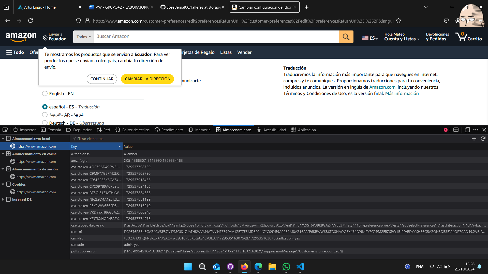
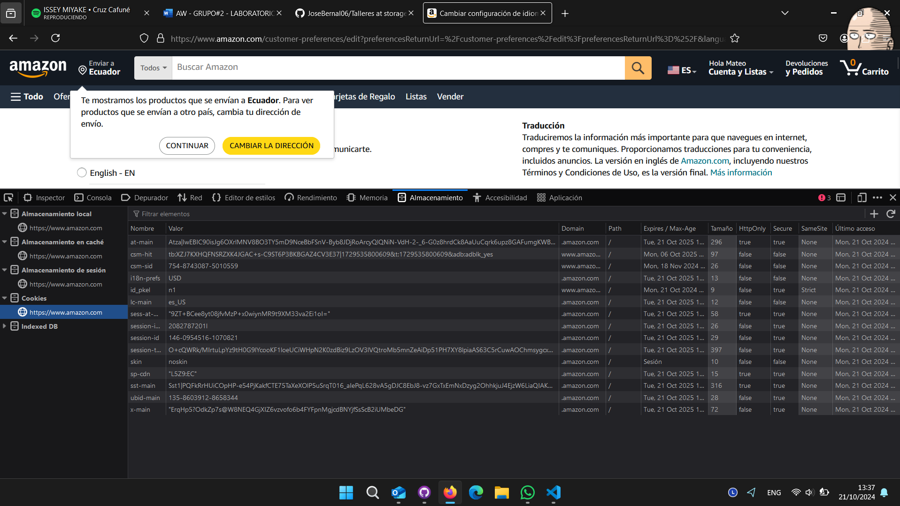
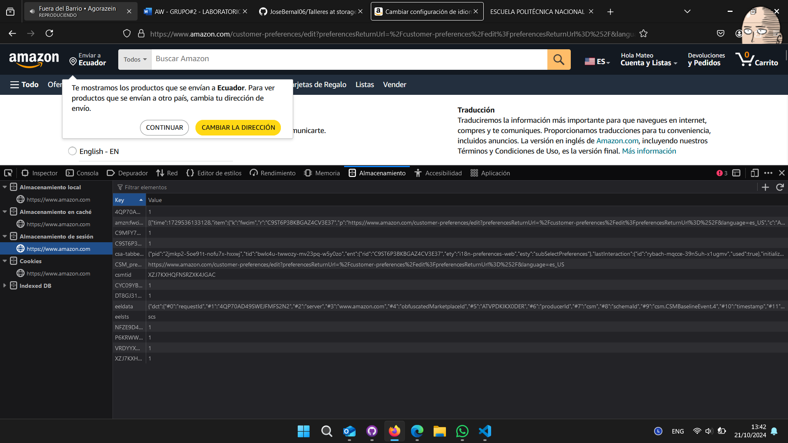

# storage-modules
En el siguiente repositorio se encuentra la practica realizada de taller en forma individual / grupal

* Taller 6 - storage-modules

# Resolucion del taller
Para la resolucion del taller 6 se selecciono la pagina web de amazon, durante el desarrollo del taller se entro la siguiente informacion:

1. Local Storage
    En esta parte se muestra el Local Storage de la pagina web, en este lugar se almacenan los datos de manera temporal de la sesion actual.
    

2. Cookies
    En esta parte se muestran las cookies de la pagina web, en este lugar se almacena informacion especifica del usuario como sus preferencias, datos de inicio de sesion y actividad del sitio.
    

3. Session Storage
    En esta parte se muestra el Session Storage de la pagina web, en este lugar se almacena información específica de la sesión del usuario, como el estado actual de una aplicación web o datos temporales de formularios, esta informacion se almacena de manera temporal.
    

